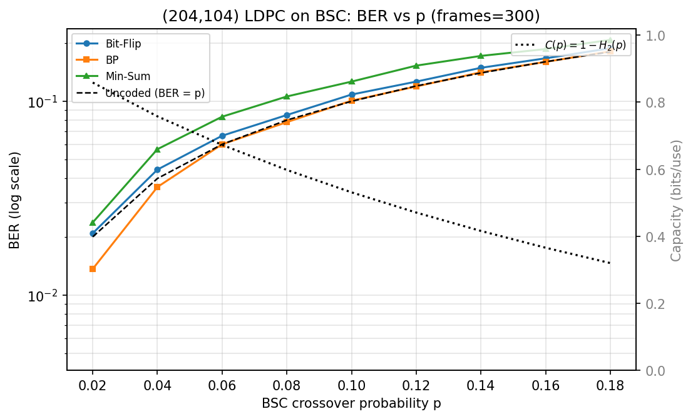
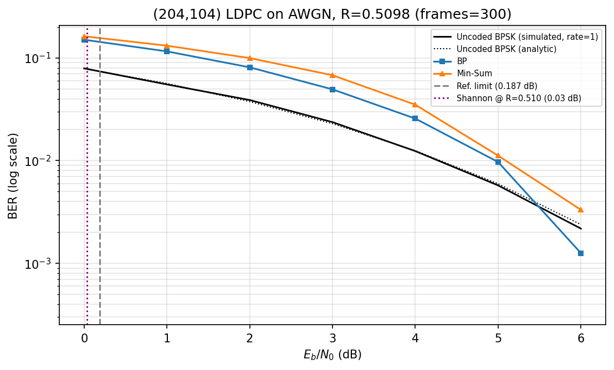
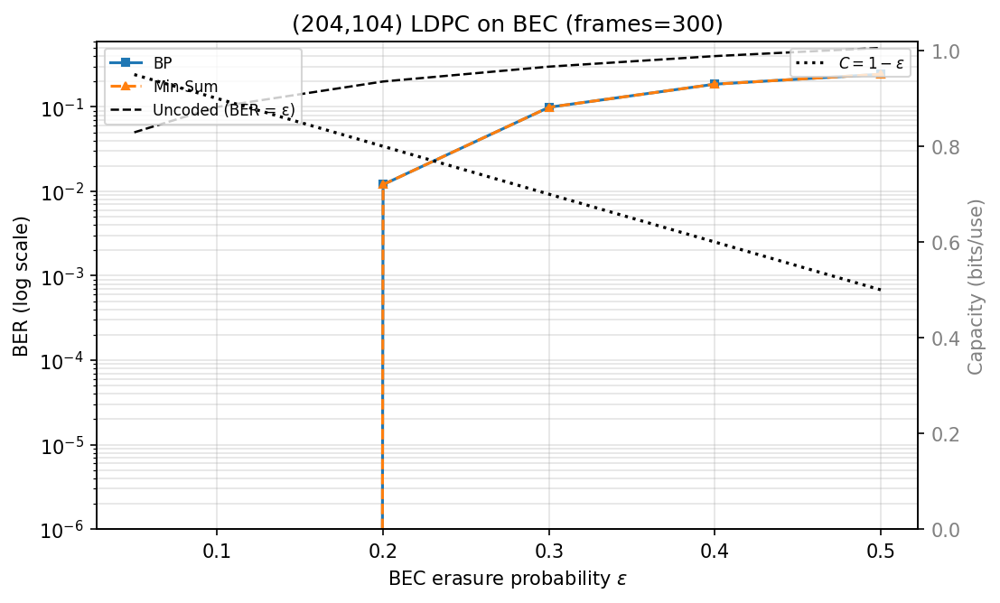
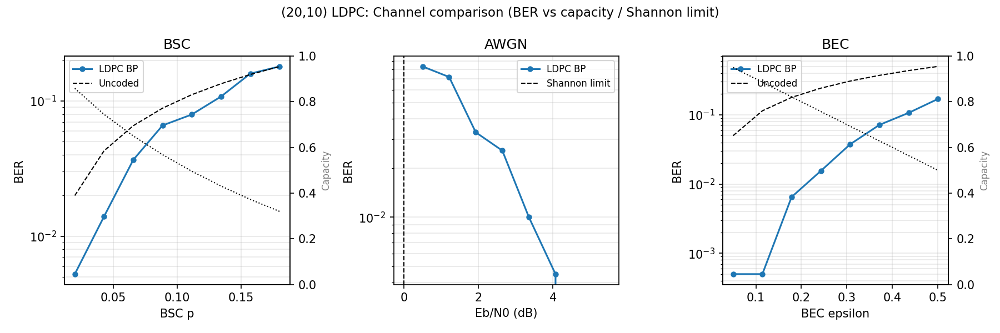

# LDPC Codes Implementation


A Python implementation and experimental study of **Low-Density Parity-Check (LDPC) codes** for an Information Theory course project. The repository includes Gallager-style LDPC code construction, systematic encoding over GF(2), multiple channel models, iterative decoders, Monte Carlo bit error rate (BER) simulations, capacity comparisons, an interactive demonstration, and automatic PDF report generation.

This project is designed as both a coursework submission and a portfolio-ready research foundation for channel coding, information theory, and error-correcting code experiments.

## Key Features

- Gallager regular LDPC parity-check matrix construction
- Systematic generator matrix construction over GF(2)
- LDPC encoding and syndrome verification
- Binary Symmetric Channel (BSC)
- Additive White Gaussian Noise (AWGN) channel
- Binary Erasure Channel (BEC)
- Bit-Flipping decoder for hard-decision decoding
- Belief Propagation (BP) decoder for soft-decision decoding
- Min-Sum decoder as a lower-complexity BP approximation
- Monte Carlo BER simulations across channel parameters
- Shannon limit and channel capacity comparisons
- Interactive LDPC demonstration for step-by-step decoding intuition
- Automatic report generation as a PDF

## Project Structure

```text
LDPC-Codes-Implementation/
+-- results/
|   +-- figures/
|   |   +-- ber_awgn_with_shannon.png
|   |   +-- ber_bec_with_capacity.png
|   |   +-- ber_bsc_with_capacity.png
|   |   +-- channel_comparison.png
|   +-- tables/
|   +-- summaries/
|       +-- experiment_summary.json
+-- legacy/
|   +-- experiments_20_10.py
|   +-- simple_demo_20_10.py
+-- tests/
+-- experiment.py
+-- generate_report.py
+-- ldpc.py
+-- ldpc_construction.py
+-- report.pdf
+-- requirements.txt
+-- README.md
```

### File Overview

| Path | Description |
| --- | --- |
| `ldpc.py` | Core LDPC operations, channel models, capacity helpers, and decoders. |
| `ldpc_construction.py` | Gallager regular LDPC construction utilities for target block lengths. |
| `experiment.py` | Larger Monte Carlo simulation script for BSC, AWGN, and BEC experiments. |
| `generate_report.py` | Generates the project PDF report. |
| `results/figures/` | Generated BER and channel comparison figures. |
| `results/tables/` | Reserved for generated tables. |
| `results/summaries/` | Generated JSON summaries and simulation metadata. |
| `legacy/` | Older small-code `(20,10)` demonstration scripts kept for reference. |
| `tests/` | Test directory for future validation scripts. |
| `report.pdf` | Generated project report. |
| `requirements.txt` | Python package dependencies. |

## Installation

Clone the repository:

```bash
git clone https://github.com/faisaliqbal946/LDPC-Codes-Implementation.git
cd LDPC-Codes-Implementation
```

Create and activate a virtual environment:

```bash
python -m venv .venv
```

On Windows:

```bash
.venv\Scripts\activate
```

On macOS or Linux:

```bash
source .venv/bin/activate
```

Install dependencies:

```bash
pip install -r requirements.txt
```

## Required Dependencies

The project uses:

- `numpy` for matrix operations, GF(2) arithmetic, random bit generation, and simulation logic
- `matplotlib` for BER and capacity plots
- `fpdf2` for automatic PDF report generation

Dependencies are listed in [`requirements.txt`](requirements.txt).

## Usage Examples

Run the main Monte Carlo simulation:

```bash
python experiment.py
```

Generate the project report:

```bash
python generate_report.py
```

The older small-code `(20,10)` demo scripts are preserved in `legacy/` for reference:

```bash
python legacy/simple_demo_20_10.py
python legacy/experiments_20_10.py
```

## Running Simulations

For the main Monte Carlo simulations:

```bash
python experiment.py
```

The main simulation script generates BER curves for BSC, AWGN, and BEC channels and saves output figures to the `results/figures/` directory. JSON simulation summaries are saved to `results/summaries/`.

For a faster smoke test:

```bash
EXPERIMENT_QUICK=1 EXPERIMENT_FRAMES=50 python experiment.py
```

On Windows PowerShell:

```powershell
$env:EXPERIMENT_QUICK="1"
$env:EXPERIMENT_FRAMES="50"
python experiment.py
```

For smoother curves with more Monte Carlo frames:

```bash
EXPERIMENT_FRAMES=1000 python experiment.py
```

Optional environment variables:

| Variable | Purpose |
| --- | --- |
| `EXPERIMENT_FRAMES` | Number of Monte Carlo frames per simulation point. |
| `EXPERIMENT_MAX_ITER` | Maximum iterations for BP and Min-Sum decoders. |
| `EXPERIMENT_MAX_ITER_BF` | Maximum iterations for the Bit-Flipping decoder. |
| `EXPERIMENT_WORKERS` | Number of worker processes for parallel sweeps. |
| `EXPERIMENT_QUICK` | Enables a reduced sweep for quick validation. |
| `EXPERIMENT_CONSTRUCTION_SEED` | Seed used for LDPC construction. |

## Generating the Report

Generate the PDF report:

```bash
python generate_report.py
```

The report is written to:

```text
report.pdf
```

The generated report summarizes the LDPC construction, encoding process, channel models, decoding algorithms, simulation results, and conclusions.

## Results

The following plots are generated in the `results/figures/` directory. They can be updated by rerunning the simulation scripts.

### BSC BER with Capacity Comparison



### AWGN BER with Shannon Limit



### BEC BER with Capacity Comparison



### Channel Comparison



The numerical simulation summary is saved in:

```text
results/summaries/experiment_summary.json
```

## Technical Scope

This implementation focuses on educational clarity and experimental reproducibility. It demonstrates the full LDPC workflow:

1. Construct a sparse parity-check matrix `H`.
2. Convert `H` into a systematic generator matrix `G` over GF(2).
3. Encode binary messages into valid LDPC codewords.
4. Transmit codewords through noisy channels.
5. Decode received words using iterative decoding algorithms.
6. Estimate BER with Monte Carlo simulation.
7. Compare empirical behavior with theoretical capacity limits.

## References

1. R. G. Gallager, *Low-Density Parity-Check Codes*, MIT Press, 1963.
2. D. J. C. MacKay, *Information Theory, Inference, and Learning Algorithms*, Cambridge University Press, 2003.
3. T. Richardson and R. Urbanke, "Efficient Encoding of Low-Density Parity-Check Codes," *IEEE Transactions on Information Theory*, vol. 47, no. 2, 2001.
4. T. Richardson and R. Urbanke, *Modern Coding Theory*, Cambridge University Press, 2008.
5. C. E. Shannon, "A Mathematical Theory of Communication," *Bell System Technical Journal*, 1948.

## Author

**Faisal Iqbal**  
Course: Information Theory  
Project: LDPC Codes Implementation  
Language: Python  
Topic: Low-Density Parity-Check Codes

## Repository

GitHub: [faisaliqbal946/LDPC-Codes-Implementation](https://github.com/faisaliqbal946/LDPC-Codes-Implementation)
